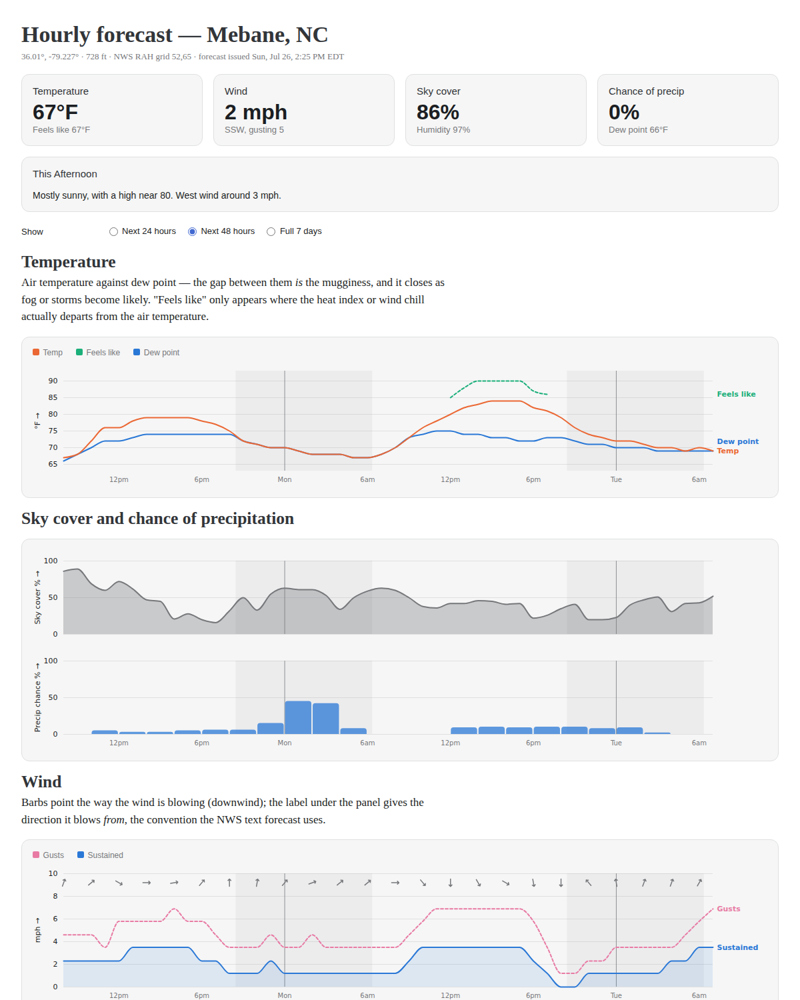

# NWS hourly forecast: an Observable Framework meteogram

An interactive rebuild of the National Weather Service **graphical forecast** page —
the one at
[`forecast.weather.gov/MapClick.php?…&FcstType=graphical`](https://forecast.weather.gov/MapClick.php?w0=t&w2=wc&w3=sfcwind&w3u=1&w4=sky&w13u=0&w14u=1&w15u=1&AheadHour=0&Submit=Submit&FcstType=graphical&textField1=36.01&textField2=-79.227&site=all&unit=0&dd=&bw=)
that plots temperature (`w0=t`), wind chill (`w2=wc`), surface wind (`w3=sfcwind`) and
sky cover (`w4=sky`) for a point — built on
**[Observable Framework](https://observablehq.com/framework)**, same shape as the
`well-viz-real-data` app in this repo: Python data loaders fetch live data at build
time, Observable Plot draws it, and a scheduled rebuild republishes.

Default point is 36.01, -79.227 (5 mi SW of Efland, NC — NWS Raleigh grid RAH 52,65),
the location in that URL.



## Run it

```bash
npm install                # once
pip install -r scripts/requirements.txt
npm run dev                # dev server at http://127.0.0.1:3000
npm run build              # static site to dist/
```

No API key: the NWS API is open and public-domain. It does ask that clients identify
themselves, so set a contact string if you deploy this anywhere real:

```bash
export NWS_USER_AGENT="(my-site.example, me@example.com)"
export NWS_LAT=36.01 NWS_LON=-79.227   # anywhere in the US
export NWS_HOURS=168                    # forecast horizon
```

> Framework caches loader output under `src/.observablehq/cache`. After changing the
> location, run `npm run clean` before rebuilding or you'll get the old point back.

## Where the data comes from

The NWS page renders server-side PNGs from a CGI script — there's nothing to scrape and
no numbers to recover from it. But the forecast underneath is the **National Digital
Forecast Database** grid, and that *is* a public JSON API, so this app skips the page
entirely and goes to the source:

| Endpoint | What it gives |
|---|---|
| `/points/{lat},{lon}` | which forecast office + grid cell covers the point, and its timezone |
| `/gridpoints/{office}/{x},{y}` | every NDFD element for that cell — the numbers behind the PNGs |
| `/gridpoints/{office}/{x},{y}/forecast` | the worded 7-day periods |

The one real wrinkle is the payload shape. A gridpoint response is **not** an hourly
table: each element is a list of `{validTime, value}` where `validTime` is an ISO 8601
*interval*, e.g. `2026-07-26T12:00:00+00:00/PT5H` — one entry covering five hours — and
different elements break at different points (temperature hourly, wind speed in 5-hour
blocks, wind gust in 3-hour blocks). `expand()` in `scripts/nws.py` flattens each
element onto one shared hourly grid so the whole meteogram plots against a single time
axis.

Two other things the loader handles:

- **Units.** The API answers in `degC` / `km_h-1` regardless of the page's `unit=`
  param; the loader converts to °F / mph.
- **Time.** Timestamps are emitted as naive local wall-clock strings (`2026-07-26T08:00`)
  in the *forecast's* timezone. `new Date("2026-07-26T08:00")` reads that back as the
  same clock time, so 8am in Raleigh plots at 8am no matter where the reader's browser
  is. Anything else silently shifts the diurnal cycle for out-of-region readers.

Sunrise/sunset are **not** in the API, so `scripts/nws.py` computes them locally with
the NOAA low-precision almanac (±1 min — plenty for shading night bands, and it keeps
the loader's only dependency `requests`). Verified against reality for Efland: Jul 26
06:20/20:28 EDT, Dec 21 07:24/17:07 EST.

## The page

`src/index.md` — current-conditions tiles, the worded period, then a stack of panels
sharing one time axis and one set of night bands:

- **Temperature** — air temperature, dew point, and "feels like" (heat index or wind
  chill) drawn *only where it departs from the air temperature by ≥1°F*, so it isn't a
  second line hugging the first and saying nothing.
- **Sky cover** and **chance of precipitation**.
- **Wind** — sustained and gusts, with direction barbs pointing downwind.
- **The numbers** — the same grid as a sortable table.

Charting notes: every panel is a single measure on a single y scale (no dual axes); the
range selector (24h / 48h / 7d) thins glyph marks but never repaints a series, because
color is bound to *which quantity* a line is, not to its rank; series colors live in CSS
custom properties with separately-chosen light and dark steps, so the theme toggle
repaints without re-running any JS; each panel carries a crosshair and a full readout on
hover.

```
nws-forecast-viz/
├── package.json, observablehq.config.js
├── src/
│   ├── index.md                 # the meteogram
│   └── data/forecast.json.py    # loader → scripts/nws.py → forecast.json
├── scripts/
│   ├── nws.py                   # NWS API client: fetch, interval-expand, convert, sun times
│   └── requirements.txt
└── deploy-workflow-template.yml # scheduled rebuild + GitHub Pages publish
```

## Publishing

A forecast is only as good as its last fetch, and the loaders run at build time — so
the rebuild schedule *is* the refresh rate. Copy `deploy-workflow-template.yml` to
`.github/workflows/deploy.yml`, set Pages source to "GitHub Actions", and it rebuilds
every 6 hours. NDFD updates roughly hourly, so tighten the cron if you want it fresher.

## Status

- Live fetch verified end-to-end against RAH 52,65 (168 hourly steps, 11 elements).
- `npm run build` verified; page rendered and checked in light and dark mode, with the
  hover layer and all three time ranges exercised.
- `windChill` comes back all-null in summer (the NWS only populates it when it applies);
  the "feels like" series falls back to `apparentTemperature`, which carries whichever of
  heat index / wind chill is in season.
